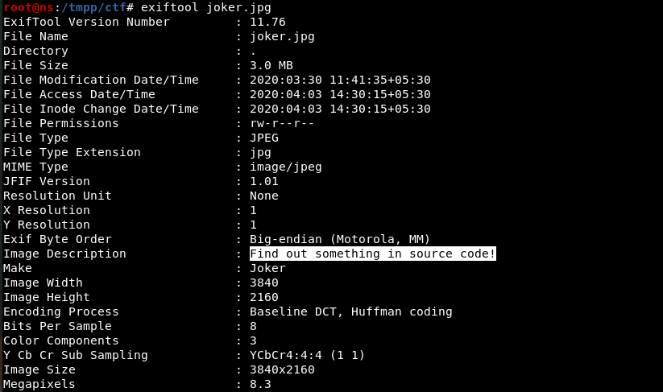
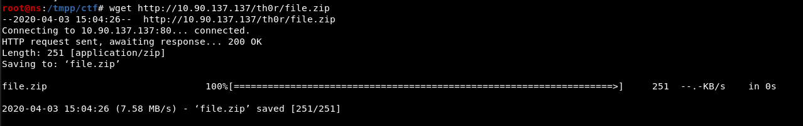

# Marvel-Vs.-DC-
CTF writeup

**Challenge 1:**

1.  Url is given
    > "[http://10.90.137.137](http://10.90.137.137)" Let's
    > see what is there.

2.  In Source we can find commented script tag.

3.  Part of which is base64 of "password". So let's look at
    > /js/password.js file.

4.  So we have a password but of what? After some time I got a directory listing in images. Observe the length of joker.jpg.

5.  Lets download the file. And do an exif read.

6.  This might be telling that the password we got earlier is the password to extract this file !!??!?!?!.. Let's try.

No luck there.. Plus the password does not look like a password. So I
tried too many encodings but no luck. Then a hint was given that the
"Timing " matters, and this looks like morse code because it has only
two characters "+" and "\>".

7.  Decode it online by changing the timing config 
    > "=" with "+" and "." with "\>".

8.  Got "busker" looks like a password. Let's try on joker.jpg

9.  The data looks like rot13. Let's decode it online.

10. The last part of the data gives it all how to decode the flag. After decoding...

11. We got base64 if let's decode it too. And finally we have the
    > FLAG...

**Challenge 2:**

12. Let's do an dirsearch...

13. robots.txt gives us many files..

14. Open them one by one and we have some susceptible stuff in
    > "batman.php"

15. Put it all together and we have one big base64 string.

16. This might suggest th0r directory. "T" in the string is capital but I got a match with "t".

17. As we can see file.zip let's download...

18. Unzip\...

19. The file "file" contains string at the end.

20. Ascii Hex decode it and get the Flag.

